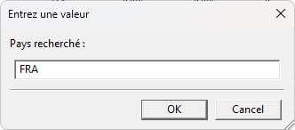

# un-wcmc-dbms
Management system for United Nations Environment Porgram World Conservation Monitoring Centre database (old version of the database).

## description
This system has been developped for 2 reasons :
   1. As a poc to validate knwoledge acquired in IFT1169 class at Université de Montréal (UdM)
   2. To train on using the wxWidgets library in C++
<br>

This application can be described as a very basic text file database management system. More specifically it has been designed to manage the United Nations Environment Program World Conservation Monitoring Centre Database which comes in a very specific text file format.<br>
### source and format of the database example
The database used to build this application and which is used as an example in the rest of the document is an old version of the World Database on Protected Areas. This old version of the database used for the example here can be downloaded directly from the current repository (see file named "data_wcmc.txt"). For information, newer version of the database can be found at the link below, in the ressources section.<br>
http://www.unep-wcmc.org/<br>
The old version of the database was presented as a simple text file with tab separated field and double quotes encapsulation for each field. Here is an example below :
```
"Kosciusko National Park" "AUS" "36¸10'S" "148¸28'E" "625525" "1977"
```
Fields are as follows :
* **first field**   : area name
* **second field**  : area country (ISO code)
* **third field**   : area latitude
* **fourth field** : area longitude
* **fifth field** : area size
* **sixth field** : area year (as a protected area)
### Overview of the application
<br><br>
As it can be seen on the screenshot above the application is composed of the following structure (from top to bottom):
* a main window
* a menu
* a ribbon
* a table (to display data)

Note that menu has submenus and ribbon has multiple pages that can contain multiple panels and buttons<br>
The different functionalities will be presented below in a separate part.
### disclaimer
It is by no means a robust application that can handle the different exceptions inherent to the use of this tool by anyone. If you intend to use the application in another context than the one it has been designed for (i.e. a poc), I will not necessarily provide assistance to make it work in your context of use. Furthermore, I will not be liable for any damages or losses that may arise from using this application.
## compiling source
There are 2 ways to compile the source to create the application executable
1. Compile directly in Windows command prompt (`cmd`) using below command (1st part)
2. Compile with MSYS2 tools in Windows using the makefile provided in the repo

Both methods assume the following :
- you are on a MS Windows environment
- you have downloaded and compiled the wxWidgets library at location `C:\Temp\wxWidgets`
- you have cloned the repo or downloaded the source files in `C:\Temp\un-wcmc-dbms`

If some of these assumptions is not true for you, you might have to adapt the commands or the makefile accordingly
### command to compile with g++
Based on comments from the previous section, for the first method you can just open a Windows command prompt and navigate to `C:\Temp\un-wcmc-dbms` using the `cd` command.<br>
Here is the final command to do so
```
cd C:\Temp\un-wcmc-dbms
```
Once done, you can copy-paste the following one liner and execute
```
g++ -o un-wcmc-dbms.exe un-wcmc-dbms.cpp -IC:/Temp/wxWidgets/lib/gcc_dll/mswu -IC:/Temp/wxWidgets/include -LC:/Temp/wxWidgets/lib/gcc_dll -mthreads -DHAVE_W32API_H -D__WXMSW__ -DNDEBUG -D_UNICODE -DWXUSINGDLL -std=c++20 -mthreads -lwxmsw32u_richtext -lwxmsw32u_xrc -lwxmsw32u_aui -lwxmsw32u_html -lwxmsw32u_adv -lwxmsw32u_core -lwxbase32u_xml -lwxbase32u_net -lwxbase32u -lwxscintilla -lwxtiff -lwxjpeg -lwxpng -lwxzlib -lwxregexu -lwxexpat -lkernel32 -luser32 -lgdi32 -lcomdlg32 -lwinspool -lwinmm -lshell32 -lcomctl32 -lversion -lshlwapi -lole32 -loleaut32 -luuid -lrpcrt4 -ladvapi32 -lwsock32 -luxtheme -loleacc -lwxmsw32u_ribbon
```
After that you should have "*un-wcmc-dbms.exe*" file in the current working directory. You can confirm that using `dir` command.<br>
This file is the executable to launch the application.
[^1]: in order to have the libraries in *wxWidgets* folder you need to compile the wxWidgets source codes with the help of the documentation provided in that same *wxWidgets* folder.
### compile with makefile and MSYS2
This method will assume one more thing : you have installed *MSYS2* tools and you are able to launch a *MSYS2 MinGW x64 (or x32)* console. If that is not the case you can visit this [link](https://www.msys2.org/docs/installer/) and read on how to install the tool<br>
Once or if you have it installed then all you have to do is launch a console and follow these 3 steps :
1. go to `C:\Temp\un-wcmc-dbms` directory using `cd` command
2. type command `make clean` just to make sure to delete all `.exe` and `.o` files
3. finally just type `make` in the console and execute

This will create a *un-wcmc-dbms.exe* file in the folder of the same name. Fire up this file and the application should start.
## functionalities
Here I will present the different functionalities of the app.
### Load a database file (tab separated text file with quotes encapsulated fields)
In order to load a database in the app you need to select `Fichier` in the menu then `Ouvrir fichier` (you can also use the shortcut `Ctrl+O` to do the same)<br><br>
<br><br>
A dialog box will open to select the file you want to load<br><br>
<br><br>
Make sure you select a valid file and click `open`. The data will populate in the table area of the application[^2].
[^2]: note that the label for the columns have been harcoded using the example database.
### Save database to a file (same type of file as for input)
To save the database into a file you just need to go to the menu select `Fichier` then `Sauvegarder fichier` (or use shortcut `Ctrl+S`)<br><br>
<br><br>
Once again a dialog box will pop up and you will be able to choose a name for the file to save[^3]<br><br>
<br><br>
Once you have entered the name for the file, click `save` to complete the process.
[^3]: note that you can save the data under the same file name as the one used as input. In this case the original file will be overwritten.
### Close application
If you want to safely close the application I encourage you to force yourself to use the menu with `Fichier` and then `Quitter` (or use `Ctrl+Q`)<br><br>
<br><br>
By doing this you will force a prompt that will ask you if you really want to close the application (leaving you one more chance to save your changes before losing them forever! ;-))<br><br>
<br><br>
If you have already saved your changes or did not make any you can click `yes` and the app will close immediately.
### View the about section
An about message has been implemented and will show you few information about the software currently running<br>
You can access that message by going into the menu in the `Info` section and click `A propos` (or `Ctrl+A` for short)<br><br>
<br><br>
The message displayed will be similar to the one below<br><br>
<br><br>
You just have to click `OK` after that to resume working in the application.
### Modifications of the data
#### Insert data
You have 4 different ways to insert data :<br><br>
<br><br>
1. **Insert data at the end of the table**<br>
If you choose this option a new line will appear at the end of the table allowing you to enter the information in the corresponding field. In this case you can choose which field you want to populate (ex : `"Mavri Gremmi" "CYP" "34¸58'N" "32¸42'E" "2900" ""` or just `"Lac de Larnaka" Y="1975"` - in these 2 cases you just enter the data in the correct fields even if some fields are missing data).
2. **Insert data at the begining of the table**<br>
In this case the new line will appear at the begining of the table but the rest of the process is the same as the one described for the first insertion method.
3. **Insert data in the middle of the range**<br>
In order to choose where to insert the new line, before clicking on the corresponding `curseur` button in the ribbon, you will have to select a row in the table. The new line will be inserted just above that row.
4. **Insert data using a file**<br>
First, the file will have to be the same format as the one described in the "*Load a database file*" section above. Then if this criteria is ok you can click on ribbon button `fichier` in the `Insertion` section. You will be prompted with a file dialog box to choose the file you want to add to the current data. Then once you select the file and click `Open` the new data will be inserted at the end of the table.
#### Delete data
There are 2 ways to delete data in this application.<br><br>
<br><br>
1. **One line delete**<br>
In this method you have to select the line you want to delete and then click `ligne` in the `Suppression` section of the ribbon. The line you just selected will be immediately deleted from the table with no possibility to get it back unless you quit without saving and you reload the original file (there is no prompt to ask for confirmation once you click `ligne`).
2. **Block delete**<br>
You can decide to select a block of ___contiguous___ lines and delete it by clicking the `bloc` button in the `Suppression` section of the ribbon. Same warnings as previous method apply here regarding data loss and confirmation prompt so please be careful while using this functionality.
#### Modify data
To modify data there is nothing as simple as this : you just have to modify the field value in the table. Again here, there is no undo function in the app so please be careful when modifying data. I encourage you to save regularly confirmed modifications in order to not lose them in case of subsequent errors.
#### Select data
There are multiple options to select data. Here we will present 3 methods to do so.<br><br>
<br><br>
1. **Select all data**<br>
For this you can use the `sél. tout` button in the ribbon. This will select the entire dataset. Note that you can unselect any selection by clicking the `désél. tout` button in the same `Selection` section of the ribbon.
2. **Select by block**<br>
You can select multiple contiguous lines together by either clicking on the top one, maintain `shift` and then click on the bottom one. Or you can select the top one, maintain your click until you reach the bottom one.
3. **Multiple select**<br>
Similar to what was described in previous method but for a different result, you can select multiple lines together that are ___not___ contiguous by clicking on each of them while maintaining the `Ctrl` button pressed on your keyboard.
### Filtering of the data
If you want to find easily a specific record in the dataset or if you want to display all the records with specific criteria, you will be able to do that by using the filtering functionality.<br><br>
<br><br>
The corresponding button for this functionality can be accessed through the `Recherches` page, in the `Filtre` section of the ribbon. You will be able to filter data on 3 different criteria :
* area name
* area year (year of introduction in the database)
* area country

For each of these criteria, once you click on the corresponding button in the ribbon, you will be prompt with a dialog box with one text field (see example below).<br><br>
<br><br>
You have to enter the value you want to filter with and make sure it is correct before clicking `OK`. Once you confirm, the table will update and display only the records that match the criteria. Note that the other lines are still in the dataset but are hidden (the size of the rows is at 0 so they do not appear on screen - see result of the previous screenshot filter below).<br><br>
<br><br>
So if you want to modify data based on certain criteria you can use the filter functionalities, then modify the lines you want and still use the save functionality to save the entire database into a file (I repeat, the lines that do not match criteria are ___not___ deleted, they are just hidden).<br>
If you want to unhide the lines that did not match previous criteria, you can do so by just clicking the `défiltrer` button in the same section of the ribbon.
## Documentation
There are multiple sources of documentation that can be of use for this application or for the context it has been designed for (i.e. poc and/or training program).
### Documentation about the app
You're in it!!!
This documentation provides the necessary information to use the application and understand the functionalities. It is available online and the "*help*" button on the right hand side of the ribbon will lead you to there.<br><br>
<br><br>
Of course if you find bugs or anything interesting enough to share, please feel free to reach out with a detailed explanation so that I can take action if necessary (correct bug, improve code, answer question, etc.).<br>
I will not sware that I will have time to treat your request but I commit to do my best in that way.
### Other relevant documentation
Of course if you want yourself to play a little bit with the code, I have provided the 2 source files for this app as well as the configuration for VSCode.<br>
In addition to that here are some really usefuls resources to understand how the code of the application works and how to play with it.<br>
* https://wiki.wxwidgets.org/Main_Page
* http://www.iro.umontreal.ca/~dift1169/cours/ift1169/communs/Cours/1P/1_03/C11_1169_1P.pdf (in french)
* https://github.com/wxWidgets/wxWidgets
